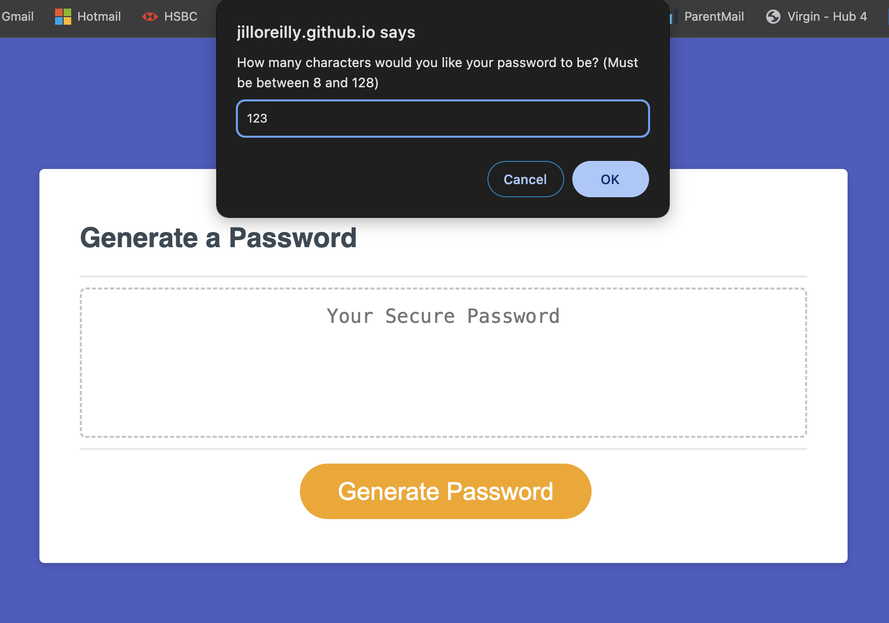

# Password Generator
Challenge 5 - Password generator - Javascript - Front-end Web Dev Bootcamp

## Description

This webpage showcases the Javascript skills I have gained from Module 5 (Intermediate JavaScript) of the Front-end Web Development Bootcamp. 

I have developed a random password based on criteria selected by the user. The app runs in the browser and features dynamically updated HTML and CSS powered by the JavaScript code that I have written.

The application has been optimised for viewing across all devices. 

## Usage

1. The **Password Generator** webpage can be accessed online on Github pages: [https://jilloreilly.github.io/password-generator/](https://jilloreilly.github.io/password-generator/
)
2. Click on the "Generate Password" button      

3. The user will be prompted to enter a number between 8 and 128 (inclusive)

4. The user will then be asked to confirm whether to include the following character sets for their password:
  - Special characters
  - Numeric characters
  - Uppercase characters
  - Lowercase characters

5. After the user has confirmed the character sets, a randomly generated password (consisting of the character sets chosen) will be printed to the screen.

## Credits

Thank you to the following:

- MDN web docs for:
  - [push()](https://developer.mozilla.org/en-US/docs/Web/JavaScript/Reference/Global_Objects/Array/push)
  - [Math.random()](https://developer.mozilla.org/en-US/docs/Web/JavaScript/Reference/Global_Objects/Math/random) 
  
- CSS Tricks for [randomly selecting item from an array](https://css-tricks.com/snippets/javascript/select-random-item-array/)

- W3CSchools for [array methods](https://www.w3schools.com/js/js_array_methods.asp)

- My tutor **Cody Junier** for helping me resolve a issue whereby a new password was appended to the previous password upon clicking "Generate password" again - Solution: remove global variables and set inside function

## License

MIT License

Copyright (c) 2023 Jill O'Reilly

Permission is hereby granted, free of charge, to any person obtaining a copy
of this software and associated documentation files (the "Software"), to deal
in the Software without restriction, including without limitation the rights
to use, copy, modify, merge, publish, distribute, sublicense, and/or sell
copies of the Software, and to permit persons to whom the Software is
furnished to do so, subject to the following conditions:

The above copyright notice and this permission notice shall be included in all
copies or substantial portions of the Software.

THE SOFTWARE IS PROVIDED "AS IS", WITHOUT WARRANTY OF ANY KIND, EXPRESS OR
IMPLIED, INCLUDING BUT NOT LIMITED TO THE WARRANTIES OF MERCHANTABILITY,
FITNESS FOR A PARTICULAR PURPOSE AND NONINFRINGEMENT. IN NO EVENT SHALL THE
AUTHORS OR COPYRIGHT HOLDERS BE LIABLE FOR ANY CLAIM, DAMAGES OR OTHER
LIABILITY, WHETHER IN AN ACTION OF CONTRACT, TORT OR OTHERWISE, ARISING FROM,
OUT OF OR IN CONNECTION WITH THE SOFTWARE OR THE USE OR OTHER DEALINGS IN THE
SOFTWARE.

## Technologies Used

